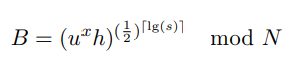

# Cryptography and Security Protocols Project
Our Project has the objective of applying the RSA-based construction of the Hash-and-Sign Signature presented in the paper ```Realizing Hash-and-Sign Signatures under Standard Assumptions```. See Paper [here](docs/2009-028.pdf)
## Project Overview
In our RSA Signature realization there are three main stages:
### 1. The Setup Stage
In this stage the algorithm chooses _N_, as the product of two large safe primes under the security assumptions of the paper. We note that N must
be a Blum-Williams integer. It then chooses two random quadratic residues _u, h_. Next, it establishes a hash function _H_ by choosing a random key _K_ for the PRF
function F, a random c and defining _HK(x) = c ⊕ FK(x)_. It then publishes the parameters L of some Chameleon Hash scheme ChamHash. 

* The **public key** consists of _N, u, h, c, K, L_.

* The setup algorithm sets its state counter
_s = 0_ and keeps the factorization of _N_ as the **secret key** _SK_.
### 2. The Sign Stage
The signer first increments its counter s by one as _s = s + 1_. The
algorithm then chooses a random _r_. It then computes _x = ChamHash(M, r)_. Next, it checks if _HK(s)_ is a prime. If not it
increments _s = s + 1_ and tries again until _es = HK(s)_ is a **prime**. 

Then the signer computes:



The signature is output as:


**Note:** Conceptually, _s_ is an index, but we will skip over many _s_ values where _HK(s)_ is not a prime.
### 3. The Verification Stage
The verification algorithm first makes sure that _0 < i < 2^λ_. If this
is false, then it rejects.
Second, the verifier checks that _HK(i)_ is a prime. If not, it rejects.Next, it squares _σ1_ a total of _lg(s)_ times yielding the value:


Finally, it computes _x = ChamHash(M, r)_ and _ei = HK(i)_, and rejects unless it verifies that:


## Deployment
In order to run the Project one must have installed the following requirements:
* Python
* pycryptodome
* libnum
    

    Commands:
        * sudo apt install python3.8
        * sudo apt install python3-pip
        * pip install pycryptodome
        * pip install libnum
          (these commands were used for an ubuntu enviorment)

Run Command: 
* ```python3 main.py ```

